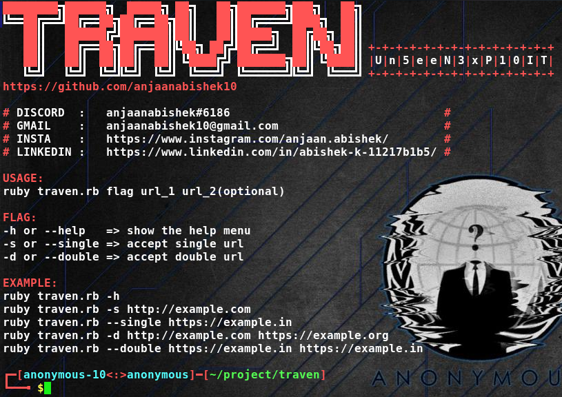

# Traven

Fuzz Dual Website in a Single Shot

<h2> Get Started: </h2>

* sudo apt install ruby-full

* sudo apt install git

* git clone https://github.com/anjaanabishek10/Traven.git

* cd Traven

<h2> Usage: </h2>

<h3> => ruby traven.rb -h </h3>

<h3> => ruby traven.rb -s https://act.edu.in </h3>

<h3> => ruby traven.rb -d https://act.edu.in https://mit.edu.in </h3>

